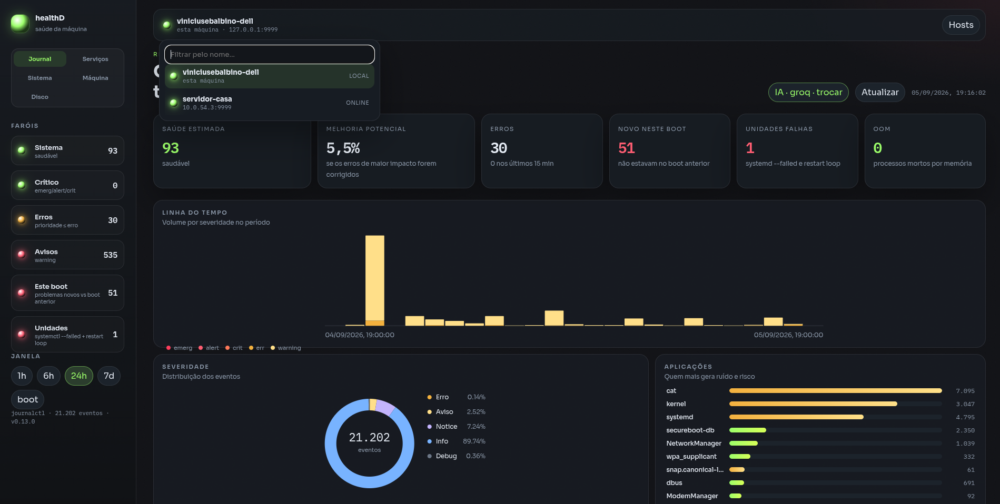
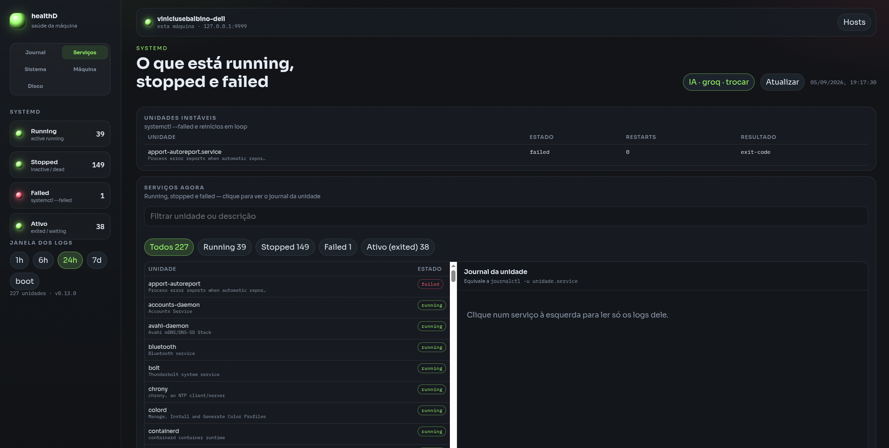
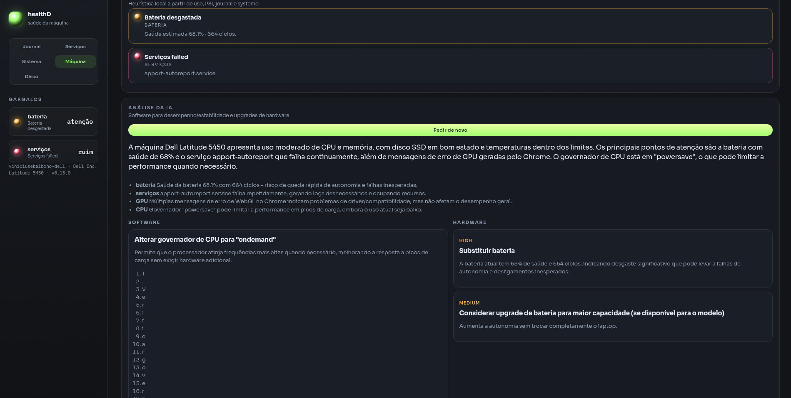
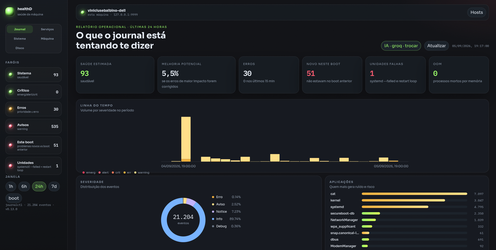
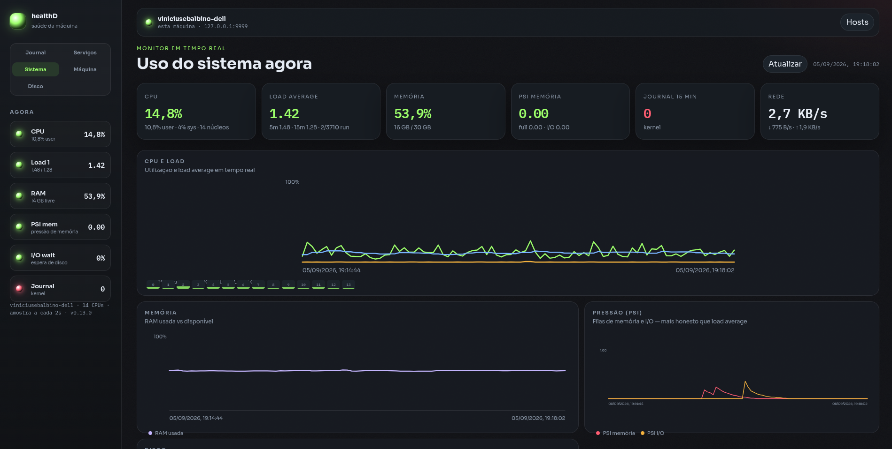

# healthD

A local machine-health dashboard: systemd journal, services, CPU/RAM/disk, hardware bottlenecks, and a LAN fleet.

No extra dependencies: Python 3 only (plus `journalctl` / `systemctl` on Linux).

## What the dashboard shows

- Health beacons (system, critical, errors, warnings)
- Most frequent errors, share of volume, and originating app
- Estimated system impact and improvement potential if those issues are fixed
- Filters by text, severity, and application
- Timeline, distribution, and systemd-unit charts
- **System** tab: live CPU, load average, RAM, PSI (memory/I/O pressure), disk (read/write), and network (in/out), plus top-10 offenders per resource and top-5 load
- **Disk** tab: sunburst map of the directories using the most space, with inspect and open-folder actions
- Journal ↔ metrics correlation: the drawer shows CPU, RAM, I/O, and PSI at the time of the last occurrence; the **Journal** beacon on the System tab lights up when the log is noisy
- **Services** tab: systemd units running/stopped/failed, `systemctl --failed`, per-unit journal (`journalctl -u`), AI on failed units, and Disable only when the unit is **not** essential
- **Machine** tab: hardware inventory (CPU, RAM, swap, disks, GPU, battery, thermal), observed usage, local bottlenecks, and **AI** suggestions for software (swappiness, governor, services, disk) and hardware (RAM, SSD, CPU, battery)
- **LAN hosts**: register other machines (`ip:port`) with a **Linux username and password** from that machine (must be in the `healthd` group); the top selector switches the dashboard without opening another URL
- OOM: processes killed for lack of memory, read from the journal
- Boot diff: what appeared in this boot and was not in the previous one
- **AI Tips**: for each grouped issue, sends context to the AI (Groq, Gemini, OpenRouter, Claude, or Claude Code) and returns a likely cause, steps, and commands

The improvement percentage is a **heuristic** (frequency × severity × unit criticality × keywords such as OOM, I/O, timeout). It is not a real performance measurement.

## AI Tips

The dashboard uses the [Groq](https://console.groq.com/keys) API on the free tier (Llama, no credit card). It also accepts Gemini, OpenRouter, the [Anthropic (Claude)](https://console.anthropic.com/settings/keys) API, and local [Claude Code](https://code.claude.com/docs/en/quickstart).

1. In the dashboard, click **Configure AI** and pick a provider
2. Groq / Gemini / OpenRouter / Claude: paste the API key  
   Claude Code: install the `claude` CLI, run `claude login` as the **same user** that runs healthD, and save without a key  
   or `python3 healthd.py --ai-provider groq --ai-key gsk_...`

The key is stored in `~/.config/healthd/ai.json` (it still reads the old `~/.config/journalctl-obs/` folder if it exists). Nothing is sent until you click **AI Tips**. After the analysis, the panel opens a chat in the same context: you can ask follow-ups, paste command output, and keep debugging.

If healthD runs as a root service under `/usr/linux-healthd`, Claude Code needs a login in `/root`. In that case the Anthropic API (`sk-ant-…`) is the simpler path.

## Usage

```bash
python3 healthd.py
```

Open [http://127.0.0.1:9999](http://127.0.0.1:9999).

```bash
python3 healthd.py --help
python3 healthd.py --user          # user journal only
python3 healthd.py --demo          # synthetic data
python3 healthd.py --port 9999
```

If the system journal needs permission, join the `systemd-journal` group or run as a user that can already read `/var/log/journal`.

## Install as a systemd service

From the project directory (any distro with systemd):

```bash
sudo sh install.sh
```

The script copies files to `/usr/linux-healthd/`, creates a Python env there if the distro allows it (and installs `requirements.txt` via pip, if present), registers the **healthd** service, then enables and starts it.

The service listens on **0.0.0.0:9999** (the machine’s LAN IP) **with login**. Host/port: `/etc/linux-healthd.conf` → `systemctl restart healthd`.

The installer tries to open port 9999 in firewalld/ufw. If it still does not open on the LAN (Fedora/RHEL often fail with “No route to host”):

```bash
sudo firewall-cmd --permanent --add-port=9999/tcp
sudo firewall-cmd --reload
curl -sS -o /dev/null -w '%{http_code}\n' http://127.0.0.1:9999/login
```

The installer creates the Linux group **`healthd`** and adds the user who ran `sudo` to it. Only members of that group can sign in (local username + password, via PAM). After `usermod -aG healthd USER`, log out and back in (or `newgrp healthd`) for the group to take effect.

```bash
sudo usermod -aG healthd YOUR_USER
systemctl status healthd
```

The installed service checks GitHub **every hour**. If git’s `VERSION` is newer, it `git clone`s and replaces `healthd.py`/`web/` under `/usr/linux-healthd` (it does not touch `.venv` or `hosts.json`). systemd then restarts `healthd`. The sidebar corner shows whether you are up to date; you can force **Update now**. To disable: `HEALTHD_AUTO_UPDATE=0` in `/etc/linux-healthd.conf`.

## Several machines on the LAN

On each LAN computer, install the service (`sudo sh install.sh`) so it listens on `0.0.0.0:9999` with authentication. For a manual run:

```bash
python3 healthd.py --host 0.0.0.0 --port 9999
```

Anyone who opens `http://IP:9999` sees the login screen. Use a **local user on that machine** who is in the `healthd` group. Binding to `127.0.0.1` (the default for `python3 healthd.py`) still needs no password.

On the dashboard you use every day, click **Hosts** and register:

- name (e.g. `lab-server`)
- address `192.168.1.20:9999`
- Linux user **on the remote machine** (`healthd` group)
- that user’s password

The selector above the title lists hosts; you can filter by name. The list (including passwords) lives in `~/.config/healthd/hosts.json` with mode `0600` — the API never returns the password.

If remote login fails, check username/password, the `healthd` group, and whether the remote healthD is bound to `0.0.0.0`.

## License

MIT






